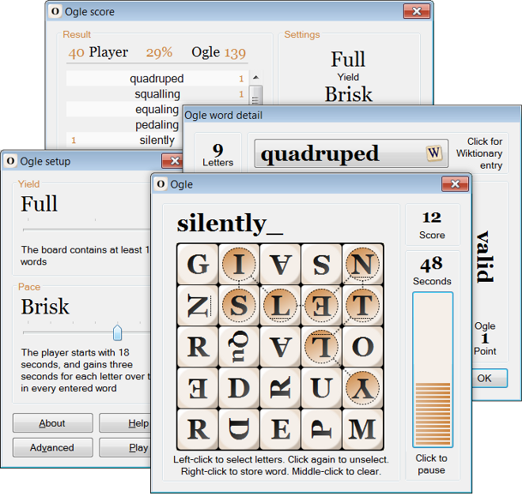

# Ogle: Word-finding game for Windows

## Overview

Ogle is a free, open source word-finding game for Windows:



I created this app when I was first learning C#. Ogle derives from a tabletop game you've probably played, but the pace is _much_ faster. I am working on a web version right now; check back later for that.

To learn more about the game, have a look at the Ogle [help pages](https://www.anthemion.org/ogle_help/index.html).


## Ogle solution

Ogle was originally created with C# 3.0, .NET Framework 3.5, and Visual Studio 2005. I have updated the solution to use Visual Studio 2019 and .NET Framework 4.5, but the code hasn't changed much since 2006.

The Ogle solution contains three projects:

* `BtnTime`: Implements the 'timer' button used on the Play form.

* `Line`: Implements the 'line' control used in several places on the Score form.

* `Ogle`: The main Ogle application.

The Ogle project references the `Release` versions of `BtnTime` and `Line`, so you should build that target _before_ `Debug`.

Several other controls are implemented within the `Ctls` folder in the Ogle project; these are too specialized to be used outside Ogle, so they do not have their own projects.

All developer-generated code uses [Split Notation](https://www.anthemion.org/split_notation.html).


## Image resources

Ogle image resources are stored in `Ogle\Main.resx`. To add or remove resources, edit `Ogle\BuildRsc\BuildRsc.cs`, then build `BuildRsc.exe` at the Visual Studio Developer Command Prompt:

```
csc BuildRsc.cs
```

Alternatively, modify existing resources referenced by `BuildRsc.cs`, then:

1) Update `Main.resx` by running `BuildRsc.exe`;

2) Copy `Main.resx` to the `Ogle` folder, replacing the instance already there.


## Sound resources

Ogle sound resources are deployed as WAV files in the `Sound` folder, within the folder containing the executable. The installer draws these and other files from `Ogle\bin\Release`.


## Other run-time files

Along with sound files, the Ogle executable expects to find a number of DLLs and license files in its folder. These are already present in the `Ogle/bin/Debug` and `Ogle/bin/Release` folders within the repository.

Lexicon files are expected to be found within the user's `Roaming` application data folder. To install these:

1) Create an `Ogle` folder within `%APPDATA%`;

2) Copy the `Ogle/Lexicon` folder into the new `Ogle` folder.

Several settings files are also maintained within the `Ogle` folder, but these are created at run-time.


## Installer

The installer was built with [Inno Setup 5.4.2 Unicode](http://www.jrsoftware.org/download.php/is-unicode.exe) and [ISTool 5.3.0.1](http://sourceforge.net/projects/istool/). Install Inno Setup _before_ installing ISTool.

The Ogle installer project is at `Ogle/Install/Ogle.iss`. You will see that the installer draws executables, license files, and sound files from the `Ogle\bin\Release` folder. It copies word files from `Ogle\Lexicon`.


## License

Ogle has copyright ©2011 Jeremy Kelly. Its use and distribution are subject to the terms of the [GNU General Public License](https://www.gnu.org/licenses/gpl-3.0.en.html)

The Ogle word lists derive from SCOWL, copyright ©2000-2004 Kevin Atkinson. Use and distribution of SCOWL are subject to the terms of the SCOWL License:

> SCOWL copyright 2000-2004 Kevin Atkinson
>
> Permission to use, copy, modify, distribute and sell these word lists, the
> associated scripts, the output created from the scripts, and its documentation
> for any purpose is hereby granted without fee, provided that the above
> copyright notice appears in all copies and that both that copyright notice and
> this permission notice appear in supporting documentation. Kevin Atkinson
> makes no representations about the suitability of this array for any purpose.
> It is provided "as is" without express or implied warranty.
